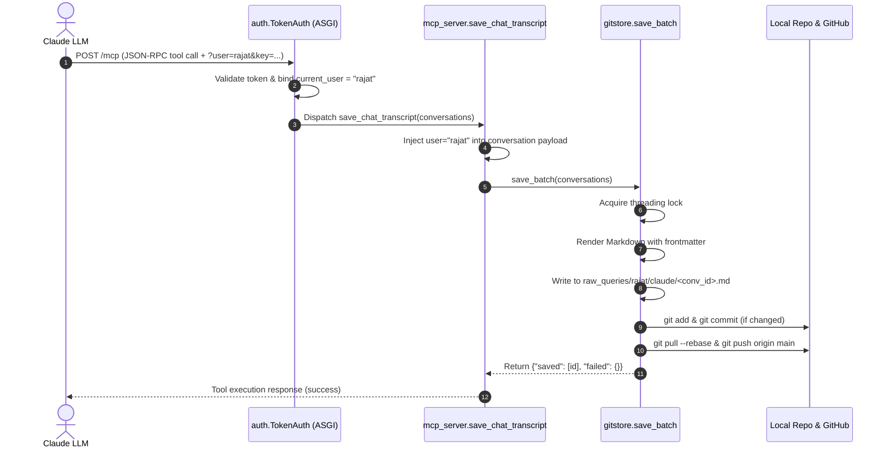
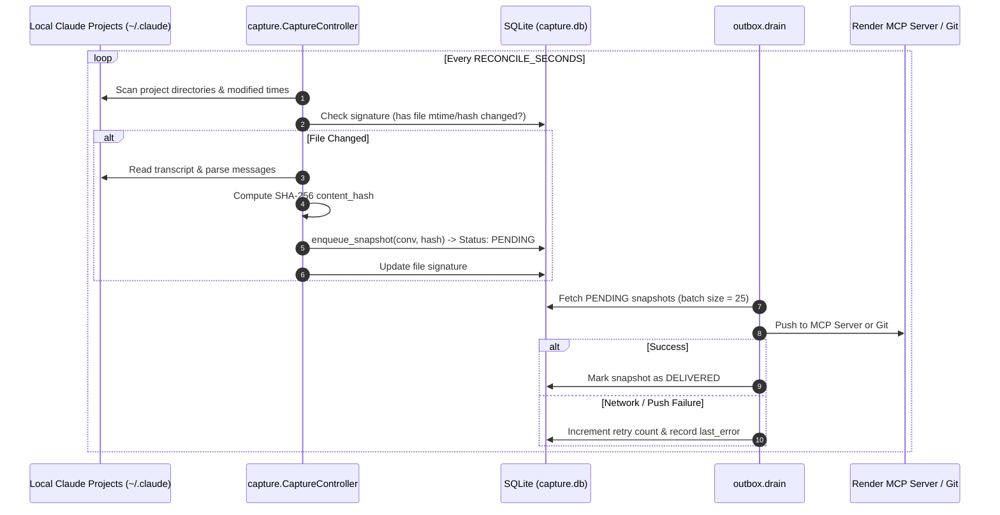

# Chat-Save: Architecture & System Design

A resilient, multi-tenant transcript capture and git-archival system for AI assistant conversations (Claude, ChatGPT, Claude Code).

---

## 1. System Overview & Topology

Chat-Save decouples transcript ingestion from git storage using the **Transactional Outbox Pattern** and a **Stateless MCP Server**. It can run in dual roles:
1. **Hosted MCP Server (e.g. on Render)**: Receives transcripts directly from Claude via the `save_chat_transcript` tool or HTTP endpoints and commits them to GitHub.
2. **Local Desktop Capture Agent (PC/Mac)**: Watches local Claude transcript directories (`~/.claude/projects`), computes content hashes, queues changes in a persistent SQLite outbox, and delivers them to the hosted MCP server or local Git.

```
┌─────────────────────────────────────────────────────────────────────────┐
│                              CLIENT TIER                                │
│                                                                         │
│   Claude Web / Desktop MCP        Claude Code CLI       Desktop Agent   │
│   [ save_chat_transcript ]        [ Stop Lifecycle ]   [ Local Scan ]   │
└───────────────────┬──────────────────────┬─────────────────────┬────────┘
                    │                      │                     │
                    │ HTTPS (JSON-RPC)     │ POST /events        │ File Watch
                    ▼                      ▼                     ▼
┌─────────────────────────────────────────────────────────────────────────┐
│                         CHAT-SAVE APPLICATION                           │
│                                                                         │
│  ┌───────────────────────────────────────────────────────────────────┐  │
│  │ 1. Authentication & Multi-Tenant Routing (app/auth.py)            │  │
│  │    • Resolves user from `?user=...`, `USER_TOKENS`, or Bearer     │  │
│  │    • Binds identity via contextvars.ContextVar                    │  │
│  └─────────────────────────────────┬─────────────────────────────────┘  │
│                                    │                                    │
│  ┌─────────────────────────────────┴─────────────────────────────────┐  │
│  │ 2. Ingestion & Protocol Interfaces                                │  │
│  │    • FastMCP Stateless Tool (`app/mcp_server.py`)                 │  │
│  │    • FastAPI REST Endpoints (`app/main.py`)                       │  │
│  └──────────────────┬──────────────────────────────┬─────────────────┘  │
│                     │                              │                    │
│                     ▼                              ▼                    │
│  ┌────────────────────────────────────┐ ┌────────────────────────────┐  │
│  │ 3. Capture & Outbox Engine         │ │ 4. Git Store Engine        │  │
│  │    (`app/capture.py`, `outbox.py`) │ │    (`app/gitstore.py`)     │  │
│  │    • SHA-256 Content Hashing       │ │    • Markdown Generator    │  │
│  │    • SQLite Persistence (`state.py`)│ │    • Atomic File Locks     │  │
│  │    • Idempotent Deduplication      │ │    • Batched Git Commits   │  │
│  │    • Startup Crash Recovery        │ │    • Remote Push & Rebase  │  │
│  └────────────────────────────────────┘ └──────────────┬─────────────┘  │
└────────────────────────────────────────────────────────┼────────────────┘
                                                         │
                                                         ▼
                                          ┌─────────────────────────────┐
                                          │     GITHUB REPOSITORY       │
                                          │ raw_queries/<user>/<id>.md  │
                                          └─────────────────────────────┘
```

---

## 2. Core Architectural Principles

### A. The Transactional Outbox Pattern
Direct synchronous Git operations during client API requests cause high latency and failure cascades. Chat-Save solves this by:
- Writing conversation snapshots and their delivery statuses to a persistent local SQLite table (`capture.db`).
- Decoupling ingestion from network writes. If GitHub is unreachable, records remain queued in the outbox and are retried automatically on subsequent reconcile cycles.

### B. Hash-Based Content Deduplication
Every conversation snapshot computes a SHA-256 digest across:
$$\text{Hash} = \text{SHA256}(\text{platform} \parallel \text{id} \parallel \text{title} \parallel \sum (\text{msg.id} \parallel \text{msg.role} \parallel \text{msg.content}))$$
If a conversation has not changed, it is dropped before initiating any disk write or Git commit.

### C. Stateless FastMCP Server
Unlike legacy servers that hack persistent Server-Sent Events (SSE) streams and parse raw JSON-RPC chunks, Chat-Save runs with `stateless_http=True`. Requests are self-contained, crash-safe, and compatible with cloud container restarts.

### D. Multi-Tenant URL Identity Resolution
Identity is resolved before tool execution:
1. **Query Parameter**: `https://<host>/mcp?user=rajat&key=<token>` binds the request context to `rajat`.
2. **Token Map**: `USER_TOKENS={"token_a": "rajat", "token_b": "shubham"}` binds user per API key.
3. Server-side context variables guarantee that transcripts are placed into the correct user directory without relying on the LLM to pass its own username.

---

## 3. Component Breakdown

```
Chat-Save/
├── app/
│   ├── auth.py          # ASGI token authentication & user context binding
│   ├── capture.py       # CaptureController: scans sources, hashes & enqueues
│   ├── config.py        # Environment variables & runtime settings
│   ├── gitstore.py      # Git manager: renders markdown, commits & pushes
│   ├── main.py          # FastAPI application & background worker loops
│   ├── mcp_client.py    # Client for agent-to-server forwarding
│   ├── mcp_server.py    # FastMCP server exposing save_chat_transcript
│   ├── models.py        # Pydantic schemas (Conversation, Message, Events)
│   ├── outbox.py        # Queue drainer & retry manager
│   ├── state.py         # SQLite persistence layer (operational state)
│   └── sources/         # Modular platform adapters
│       ├── base.py      # Abstract base class for conversation sources
│       └── claude_code.py # Local Claude Code project parser
├── storage/             # Persistent operational database (capture.db)
├── raw_queries/         # Output markdown repository (git tracked)
├── render.yaml          # Cloud deployment blueprint
└── requirements.txt     # Dependencies
```

### Module Responsibilities

| Module | Purpose |
| :--- | :--- |
| **`app/auth.py`** | Intercepts HTTP requests, validates auth tokens, extracts `?user=` or maps tokens to users, and manages `current_user` in `contextvars`. |
| **`app/mcp_server.py`** | Implements the MCP `save_chat_transcript` tool. Injects the authenticated user identity and forwards to `gitstore`. |
| **`app/gitstore.py`** | Serializes Git operations with thread locking, renders Markdown frontmatter, manages git staging, commits, and pushes. |
| **`app/state.py`** | Manages SQLite storage for the outbox queue, scan signatures, and error tracking. |
| **`app/capture.py`** | Coordinates periodic directory scans and incoming webhooks, calculating hashes and updating state signatures. |
| **`app/outbox.py`** | Drains queued snapshots from SQLite, forwarding them to the configured Git writer or upstream MCP server. |

---

## 4. End-to-End Data Flows

### Flow 1: Direct MCP Tool Call (Claude Web / Desktop)



### Flow 2: Desktop Agent Background Capture



---

## 5. Storage Schema & Git Repository Layout

### A. SQLite Operational State (`storage/capture.db`)

1. **`outbox` Table**:
   - `id` (INTEGER PRIMARY KEY)
   - `content_hash` (TEXT UNIQUE): Prevents duplicate queue items.
   - `payload` (JSON TEXT): Serialized `Conversation` model.
   - `status` (TEXT): `pending`, `delivering`, `delivered`, `failed`.
   - `retries` (INTEGER): Failure counter.
   - `last_error` (TEXT): Last exception traceback.
   - `created_at` / `updated_at` (REAL timestamps).

2. **`scan_state` Table**:
   - `platform` (TEXT): `claude`, `chatgpt`.
   - `thread_id` (TEXT): Unique session identifier.
   - `signature` (TEXT): Combined file timestamp and size to skip unread files.
   - `scanned_at` (REAL timestamp).

### B. Git Archive Layout

```text
raw_queries/
├── rajat/
│   └── claude/
│       ├── conv-supermemory-inquiry.md
│       └── conv-askcruz-architecture.md
└── shubham/
    └── claude/
        └── conv-deployment-debugging.md
```

#### Markdown Format Sample:
```markdown
---
conversation_id: conv-supermemory-inquiry
platform: claude
username: "rajat"
title: "Supermemory inquiry"
created_at: 2026-10-06T00:00:00Z
updated_at: 2026-10-06T20:29:31Z
---

# Supermemory inquiry

## User (2026-10-06T00:00:00Z)

want to know about supermemory

## Claude (2026-10-06T00:00:00Z)

Here are the key points regarding Supermemory...
```

---

## 6. Authentication & User Configuration

### Authentication Matrix

| Method | Configuration | Example / Header |
| :--- | :--- | :--- |
| **URL Query Param** | Set `MCP_AUTH_TOKEN` on server | `https://chat-save.onrender.com/mcp?user=rajat&key=SECRET_TOKEN` |
| **Multi-User Map** | Set `USER_TOKENS` on server | `USER_TOKENS={"token_rajat": "rajat", "token_shubh": "shubham"}` |
| **Bearer Token** | Set `MCP_AUTH_TOKEN` on server | `Authorization: Bearer SECRET_TOKEN` |

---

## 7. Comparison: Legacy "Threads OV" vs Current Architecture

| Quality Attribute | Legacy "Threads OV" | Current "Chat-Save" |
| :--- | :--- | :--- |
| **Coupling** | Monolithic single-script (~600 lines) | Layered modular architecture |
| **Request Latency** | High (synchronous Git clone/rebase/push per request) | Sub-second (in-memory lock + async batching) |
| **Crash Safety** | Data lost if process restarts during write | Durable SQLite outbox with automatic recovery |
| **Push Contention** | High probability of git push conflicts | Thread-serialized local execution & batched pushes |
| **Deduplication** | None (writes identical files repeatedly) | SHA-256 hash deduplication |
| **Protocol Compliance** | Hacked internal SSE paths | Standard FastMCP stateless specification |
